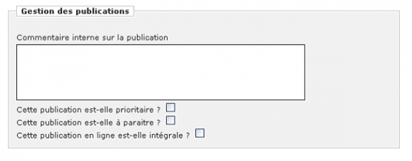

Le Modèle éditorial 
===================

Présentation
------------

Les contenus d’un site propulsé par Lodel sont stockés dans une base de données. Le modèle éditorial (ME) est une modélisation des entités contenues dans la base de données.

Le modèle éditorial définit à la fois le contenu des documents et des publications (on parle de champs), le type de documents et de publications, mais également l’ensemble des options et préférences du site.

Le modèle éditorial est une fonctionnalité très puissante, modifialbe à volonté par tout administrateur du site. Proportionnellement à sa puissance, les conséquences de sa modification peuvent être considérables, parfois très graves.

Par exemple, si vous décidez de modifier le type du texte d’un document en le passant de « texte long » à « texte court », vous allez raboter l’ensemble de vos documents pour qu’ils puissent entrer dans le nouveau format. Le retour à un « texte long » ne rétablira jamais le contenu initial des documents. De même, le modèle éditorial ayant une influence sur la définition du sch&ma XML, superstructure du document, la modification du modèle éditorial modifiera l’ensemble des fichiers XML décrivant le site et le schéma XML du site.

Lodel.org met à disposition un Modèle éditorial prédéfini, qui permet une utilisation poussée des potentialités de Lodel.

Les entités
-----------

Les modèles éditoriaux d’un site Lodel sont composés de différentes entités.

Les deux entités principales sont le document et la publication. Les documents constituent le contenu principal du site (par exemple : les articles d’une revue, les actualités). Les publications contiennent les documents, certaines peuvent également contenir d’autres publications.

Il existe différents types de publications et différents types de documents, ce qui permet d’organiser les contenus en fonction de leur teneur (article scientifique, actualité, texte de présentation…), et de leur appliquer des traitements et une mise en forme spécifiques.

On peut ajouter à la base du site cinq entités : un type de publication (collection) et quatre types de document (éditorial, article, annonce et actualité et présentation).

La collection est la première subdivision d’une revue en ligne élaborée avec le modèle éditorial de d'OpenEdition Journals. Elle se crée à la base du site et est destinée à recevoir volumes, numéros, rubriques, colloques ainsi qu’éditoriaux, articles, annonces et actualités, brèves et présentations.

Un volume, un numéro, une rubrique et un colloque peuvent contenir un volume, un numéro, une rubrique, un colloque, un regroupement, un article, une annonce et actualité, un éditorial, une brève, un compte rendu, une note de lecture, une présentation, une chronique et un article vide. Les publications de type rubrique, numéro, volume et colloque peuvent contenir un nombre illimité de publications. Un regroupement peut recevoir des documents tels qu’articles, annonces et actualités, éditoriaux, brèves, compte rendus, notes de lecture, présentations, chroniques et articles vides. Un regroupement ne peut par conséquent pas recevoir de publications.

Le modèle éditorial d'OpenEdition Journals : <https://lodel.org/668?file=1>
===========================================================================

Lodel permet à l’administrateur d’un site de définir les entités – les objets éditoriaux – avec lesquels il souhaite travailler, d’en configurer la composition en terme de champs de base de données et d’en déterminer le comportement. Ce travail, relativement complexe, demande une bonne habitude de la publication sur le Web, une certaine expérience des bases de données relationnelles et une connaissance avancée de Lodel ! Pour cette raison, on peut choisir à l’installation du logiciel d’utiliser au choix deux modèles éditoriaux, dont l’un est en tous points similaires avec celui que le Cléo utilise pour son portail OpenEdition Journals. Parce qu’il est le plus fréquemment utilisé, ce modèle fait ici l’objet d’une présentation globale.

Le modèle éditorial de Revues.org repose sur l’utilisation pour l’essentiel de trois objets éditoriaux distincts :

- Les « publication » : il s’agit de purs contenants qu’il faut se représenter comme des boîtes, encastrables les unes dans les autres autant que de besoin. Les publications peuvent être de différents types : collection (toujours à la racine du site), rubrique, numéro de revue, sous-partie, équipe, médiathèque, annuaire de sites

- Les « textes » : il s’agit des contenus longs et complexes qui sont publiés sur le site via les documents au format traitement de texte, chargés et convertis au moyen du Servoo. Les textes peuvent être des articles, des comptes rendus, des notes de lecture, des informations pratiques, des nouvelles, des chroniques
Les « textes simples » sont des contenus courts et suffisamment simples pour être édités directement dans l’interface, sans passer par la conversion de document. Il existe un seul type dans le modèle Revues.org : les billets.
D’autres entités peuvent être utilisées dans ce modèle :

- Les « documents annexes » : il peut s’agir d’images, de documents sonores, de vidéos, ou de tous types de fichiers, mais aussi de liens vers des sites web ou de commentaires attachés à des documents. Les « personnes » : prenant la forme de « notices biographiques de membre », elles permettent de gérer un « annuaire d’équipe » dans le site Lodel. Les « sites » : ils alimentent en général des annuaires de sites. On distingue les fiches de site des flux de syndication
Ces différentes entités font l’objet d’un chapitre particulier de la documentation.

Structure du site et champs dans le modèle éditorial de revues.org
==================================================================

Les modèles éditoriaux mettent en place de contraintes sur les types de structuration qu’ils autorisent. Ils interdisent ainsi les structurations absurdes (un numéro de revue dans une sous-partie par exemple), ou qui ne sont pas souhaitées. Le modèle éditorial de Revues.org repose sur un nombre limité de règles simples :

- Les « collections » sont nécessairement définies à la racine de l’arborescence documentaire du site.
- Les « numéros » et « rubriques » ne peuvent pas être créées à la racine du site.
- Les « sous-parties » se trouvent uniquement dans les numéros et les rubriques
- Les « textes » ne peuvent se trouver à la racine du site
- Les « fichiers » ne peuvent être placés à la racine du site
- Les « personnes » ne peuvent être insérées qu’au sein de publications de type « Equipe »
C’est l’application des règles du modèle éditorial qui explique que certains types de publications ou de documents ne sont pas disponibles et ne peuvent être créés selon l’endroit où l’on se trouve dans l’arborescence du site.

Dans la page d’édition des publications, le bloc de « Gestion des publications » est propre au modèle éditorial de Revues.org. Il permet de transmettre des informations qui, si elles sont utilisées par la maquette, déclenchent des affichages spécifiques :

Bloc de gestion des publications

- « Cette publication est-elle prioritaire ? » Dans les maquettes conçues par Revues.org, cette option permet de faire remonter la publication à la « Une » de la page d’accueil du site.
- « Cette publication est-elle à paraître ? » Dans les maquettes conçues par Revues.org, cette option permet d’afficher le numéro des revues à paraître dans la barre de navigation, sous l’intitulé adéquat.
- « Cette publication est-elle en texte intégral ? » Dans les maquettes conçues par le Cléo, cette option permet de signaler dans la barre de navigation que ce numéro est en libre accès et n’est pas dans la barrière mobile.

